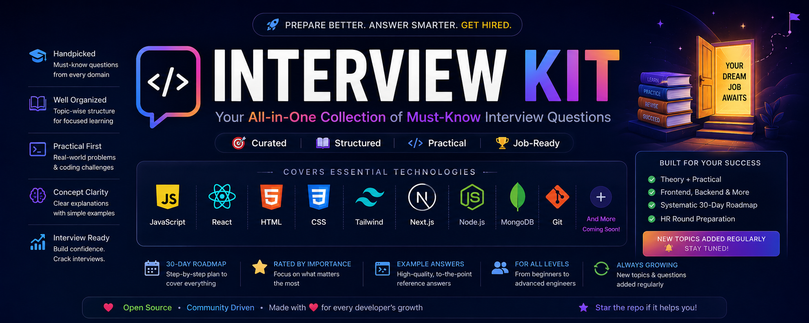

  

---

## 📊 Global Rating System

| Rating | Importance |
| ------ | ---------- |
| ⭐⭐⭐⭐⭐ | 🔥 Must Know — very commonly asked |
| ⭐⭐⭐⭐ | Important — commonly asked |
| ⭐⭐⭐ | Good to Know — useful for stronger interviews |

---

## 📚 Technology Guide Index

| Technology | Guide File | Key Theory Sections | Key Coding / Practical Sections |
| :--- | :--- | :--- | :--- |
| **🟨 JavaScript** | [`javascript-interview-kit/README.md`](./javascript-interview-kit/README.md) | Fundamentals, Scope, Hoisting/TDZ, Closures, `this`, Prototypes, Event Loop, Promises | Array/String problems, Polyfills (`map`, `filter`, `reduce`), `call/apply/bind`, `debounce/throttle` |
| **⚛️ React** | [`react-interview-kit/README.md`](./react-interview-kit/README.md) | Virtual DOM, Hooks & Linked Lists, Fiber Reconciliation, React 18 Batching, Context Pitfalls | Custom hooks (`useFetch`, `useDebounce`), Compound Components (`<Tabs>`), Modals with Portals |
| **🌐 HTML5** | [`html-interview-kit/README.md`](./html-interview-kit/README.md) | Semantic HTML, Accessibility & ARIA, Script loading (`async`/`defer`), Web Storage, Media | Accessible forms with live regions, Responsive `<picture>`, Native `<dialog>` modal API |
| **🎨 CSS3** | [`css-interview-kit/README.md`](./css-interview-kit/README.md) | Box Model, Specificity `(A,B,C,D)`, Stacking Context & BFC, Flexbox vs Grid, Reflow/Repaint | 3 centering methods, Responsive Holy Grail grid, Text truncation & multi-line clamping |
| **💨 Tailwind CSS** | [`tailwind-interview-kit/README.md`](./tailwind-interview-kit/README.md) | Utility-first paradigm, JIT engine regex scanning, Theme tokens, Class merging, Breakpoints | `cn(...)` utility, Reusable CVA Button variants, Responsive Cards with dark mode |
| **🚀 Next.js** | [`next-js-interview-kit/README.md`](./next-js-interview-kit/README.md) | App Router vs Pages Router, Server vs Client Components, SSR/SSG/ISR/PPR, 4 Caching Tiers | ISR Dynamic Routes, Authenticated Zod Route Handler, Server Actions with `useOptimistic` |
| **🟢 Node.js** | [`node-js-interview-kit/README.md`](./node-js-interview-kit/README.md) | V8 vs Libuv, 6 Event Loop Phases, Streams & Backpressure, Cluster vs Workers, Graceful Shutdown | Large file Transform streams, In-memory rate limiter, Production server shutdown handling |
| **🍃 MongoDB** | [`mongo-db-interview-kit/README.md`](./mongo-db-interview-kit/README.md) | BSON vs JSON, Embedding vs Referencing, ESR Indexing Rule, Aggregation Stages, Replication | Complex analytics aggregation, Mongoose pre-save hooks & schemas, Multi-doc ACID transactions |
| **🐙 Git** | [`git-interview-kit/README.md`](./git-interview-kit/README.md) | Object Store (Blobs, Trees, Commits), Merge vs Rebase, Reset (`--soft/mixed/hard`) vs Revert | Interactive Rebase (`-i`), Merge conflict resolution, Disaster recovery with `git reflog` |
| **🤝 HR Round** | [`hr-interview-kit/README.md`](./hr-interview-kit/README.md) | Tell me about yourself, Company fit, Strengths/weaknesses, STAR behavioral scenarios, Conflict resolution | 90-second intro script, Salary negotiation, Notice period, Questions to ask HR |

---

## 🏆 Master 30-Day Preparation Blueprint

| Week | Days | Focus | Topics |
| :--- | :--- | :--- | :--- |
| **Week 1** | 1–3 | Foundations | HTML & Accessibility Landmarks |
| | 4–7 | | CSS (Box Model, Specificity, Flexbox & Grid) + Tailwind CSS |
| **Week 2** | 8–10 | Core JavaScript Mastery | JS Scope, Closures, Execution Context & `this` |
| | 11–12 | | Event Loop, Microtasks & Promises |
| | 13–14 | | JS Coding: Array/String Algorithms & Polyfills |
| **Week 3** | 15–18 | Frontend Frameworks | React (Fiber, Hooks, Reconciliation & Performance) |
| | 19–21 | | Next.js (App Router, Server Components, ISR & Caching) |
| **Week 4** | 22–24 | Backend, Database, Version Control & HR | Node.js (Libuv, Event Loop Phases & Streams) |
| | 25–27 | | MongoDB (Schema Design, ESR Indexing & Aggregations) |
| | 28–29 | | Git (Internals, Merge vs Rebase, Disaster Recovery) |
| | 30 | | HR Round (STAR stories, salary negotiation, closing questions) |

## How to use

1. Open the kit that matches the round you are preparing for.
2. Read that folder’s README for the topic map and suggested study order.
3. Open `TOPICS.md` inside that kit and fill in the matching topic file.
4. Practice out loud. Write answers in the topic file, then compare them with the notes in the kit README.

## License

This project is licensed under the [MIT License](LICENSE).